# Entity-Relationship Design

PostgreSQL 16, 53 tables. Every business table follows the same base shape unless
noted: `id` (bigint PK), `timestamps`, and — for tables users can delete — `softDeletes`.
Foreign keys are `restrictOnDelete()` by default (referenced master data can't be
deleted while in use) or `nullOnDelete()` where the relationship is optional.

## Core lifecycle domain

This is the flagship subsystem — the interactive tyre/axle installation view and the
lifecycle audit trail are built entirely on these tables.

```mermaid
erDiagram
    VEHICLES ||--o{ TYRE_INSTALLATIONS : "mounts"
    VEHICLES }o--|| AXLE_CONFIGURATIONS : "uses"
    VEHICLES }o--|| VEHICLE_MODELS : "is a"
    VEHICLES }o--|| VEHICLE_CATEGORIES : "categorized as"
    TYRES ||--o{ TYRE_INSTALLATIONS : "has history of"
    TYRES ||--o{ INSPECTIONS : "inspected in"
    TYRES ||--o{ REPAIRS : "repaired in"
    TYRES ||--o{ RETREADS : "retreaded in"
    TYRES ||--o{ TYRE_EVENTS : "logs"
    TYRES ||--o| SCRAP_RECORDS : "scrapped as"
    TYRE_POSITIONS ||--o{ TYRE_INSTALLATIONS : "mounted at"
    TYRE_ROTATIONS ||--o{ TYRE_INSTALLATIONS : "groups"
    PURCHASE_ORDERS ||--o{ PURCHASE_ORDER_ITEMS : "lines"
    TYRES }o--|| TYRE_BRANDS : "brand"
    TYRES }o--|| TYRE_SIZES : "size"

    VEHICLES {
        bigint id PK
        string code UK
        bigint vehicle_model_id FK
        bigint vehicle_category_id FK
        bigint axle_configuration_id FK
        bigint site_id FK
        bigint odometer_km
        bigint engine_hours
        string status
    }
    AXLE_CONFIGURATIONS {
        bigint id PK
        string code UK
        tinyint axle_count
        json layout "position codes, x/y, is_dual, is_spare"
    }
    TYRES {
        bigint id PK
        string serial_number UK
        string barcode_code UK
        bigint tyre_brand_id FK
        bigint tyre_size_id FK
        string status "in_stock|installed|removed|in_repair|retreaded|scrapped|lost"
        bigint current_vehicle_id FK
        bigint current_tyre_position_id FK
        int retread_count
        decimal cost
    }
    TYRE_INSTALLATIONS {
        bigint id PK
        bigint tyre_id FK
        bigint vehicle_id FK
        bigint tyre_position_id FK
        timestamp installed_at
        bigint odometer_km_at_install
        timestamp removed_at "null = currently mounted"
        bigint removal_reason_id FK
        bigint tyre_rotation_id FK "set when part of a batch rotation"
    }
    TYRE_ROTATIONS {
        bigint id PK
        bigint vehicle_id FK
        timestamp rotation_date
    }
    INSPECTIONS {
        bigint id PK
        bigint tyre_id FK
        string type "daily|periodic|pressure|tread|damage"
        decimal tread_depth_mm
        decimal pressure_psi
        bigint failure_code_id FK
        bigint damage_type_id FK
        timestamp inspected_at
    }
    TYRE_EVENTS {
        bigint id PK
        bigint tyre_id FK
        string event_type
        string ref_type "polymorphic-style pointer"
        bigint ref_id
        timestamp event_date
    }
    PURCHASE_ORDERS {
        bigint id PK
        string code UK
        bigint supplier_id FK
        string status
        date order_date
        decimal total_amount
    }
    PURCHASE_ORDER_ITEMS {
        bigint id PK
        bigint purchase_order_id FK
        bigint tyre_brand_id FK
        bigint tyre_size_id FK
        int quantity
        int received_quantity
    }
```

### Design notes

- **`tyre_installations` is the source of truth for "what's mounted where."** A row
  with `removed_at = null` is the tyre currently on that vehicle/position. Installing,
  removing, and rotating tyres always goes through `TyreLifecycleService`, which closes
  and opens these rows inside a single DB transaction — a tyre can never appear mounted
  twice.
- **`axle_configurations.layout`** is a JSON array of position descriptors
  (`{ tyre_position_id, axle_no, side, is_dual, is_spare, x, y }`). This is what lets one
  generic Interactive Axle View component render a 4x2 rigid truck, a 6x4 haul truck, an
  8-tyre trailer, or a bus — the frontend never hardcodes an axle layout.
- **`tyre_events`** is a denormalized, append-only audit log written by every lifecycle
  action (install/remove/rotate/inspect/repair/retread/scrap/lost). `ref_type`/`ref_id`
  point back at the originating row (e.g. a `tyre_installations` row) without a real
  polymorphic FK constraint, since the referenced table varies by `event_type`. This
  table powers the Tyre History and Lifecycle Timeline screens.
- **Soft deletes** are used on `tyres`, `vehicles`, `purchase_orders`, and all 20 generic
  master-data tables, so records referenced by transactional history are never hard-deleted.
- **Every create/update/delete on an audited model** is separately captured in
  `audit_logs` by the `Auditable` trait (model observer), independent of `tyre_events` —
  `audit_logs` is a technical/security trail (who changed what field), `tyre_events` is a
  business-domain trail (what happened to this tyre).

## Full table inventory (53 tables)

### Master Data — 21 reference/lookup tables
`vehicle_categories`, `vehicle_models`, `axle_configurations`, `tyre_positions`,
`tyre_brands`, `tyre_patterns`, `tyre_sizes`, `tyre_types`, `sites`, `warehouses`,
`customers`, `projects`, `suppliers`, `failure_codes`, `damage_types`,
`removal_reasons`, `scrap_reasons`, `repair_types`, `retread_vendors`,
`inspection_checklists`, `inspection_checklist_items`

### Core Fleet / Tyre — 3 tables
`vehicles`, `vehicle_readings` (odometer/engine-hour snapshots for cost-per-km/hr
deltas), `tyres`

### Transactions — 18 tables
`purchase_orders`, `purchase_order_items`, `goods_receipts`, `goods_receipt_items`,
`initial_stock_entries`, `stock_movements`, `stock_transfers`, `stock_transfer_items`,
`stock_adjustments`, `tyre_installations`, `tyre_rotations`, `inspections`, `repairs`,
`retreads`, `warranty_claims`, `scrap_records`, `lost_records`, `tyre_events`

### Settings / Auth / System — 11 tables
`users`, `permissions`, `roles`, `model_has_permissions`, `model_has_roles`,
`role_has_permissions` (spatie/laravel-permission), `company_profile`,
`notification_preferences`, `approval_workflows` + `approval_steps` +
`approval_requests` + `approval_actions`, `barcode_rfid_configs`, `audit_logs`,
`system_configurations`, `refresh_tokens`

### Framework tables — 6 tables
`password_reset_tokens`, `sessions`, `cache`, `cache_locks`, `jobs`, `job_batches`,
`failed_jobs`
